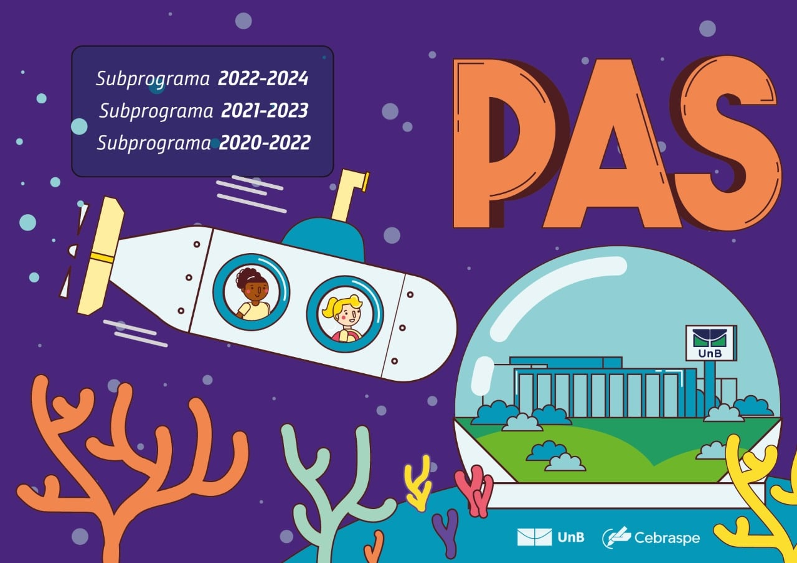

# exam-pas



Este é um projeto em React para trabalhar em conjunto com o projeto **PAS Vision**. É uma ferramenta - destinada aos estudantes que irão prestar esse exame ou já iniciaram alguma das etapas - capaz de fornecer uma probabilidade de aprovação dado o curso desejado, se é cotista e preferencialmente notas das duas primeiras etapas.

Mais detalhes sobre o projeto **PAS Vision** podem ser encontrados no [repositório](https://github.com/MarcosAugusto47/exam-pas).

## Como executar o projeto
1. Clone este repositório

    ```bash
    git clone https://github.com/brunoxz10/exam-pass-app.git
    ```

2. `cd` para o diretório `exam-pass-app`

3. Instale as dependências com

    ```bash
    npm install
    ```

4. Inicie a aplicação com 

    ```bash
    npm run dev
    ```

5. Acesse a aplicação em http://localhost:5173/

### Para consumir os dados da API
Baixe o [repositório](https://github.com/MarcosAugusto47/exam-pas) do **PAS Vision** e siga as instruções para subir a API e consumir os dados.